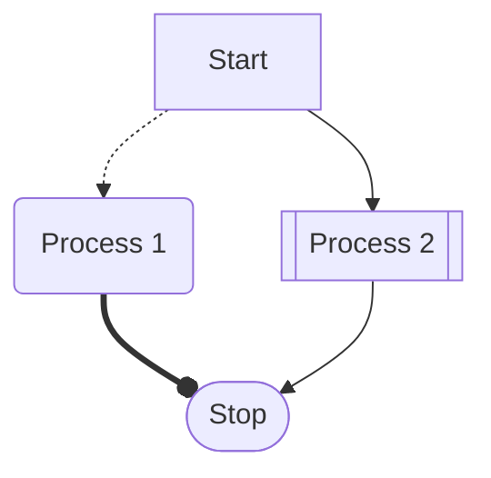
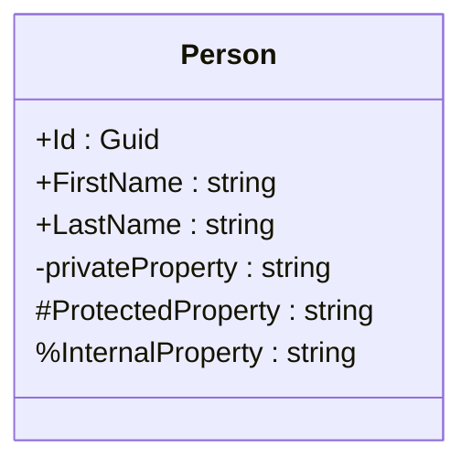

# 02 - Introduction to Object-oriented Design

A quick demo of using Mermaid to embed diagrams in markdown documents.

## Flowcharts

```mermaid
graph TB
	A[Start] -.-> B(Process 1)
	A --> C[[Process 2]]
	B ==o D([Stop])
	C --> D
```

## Class Diagrams

```mermaid
classDiagram
	class Person {
		+Id : Guid
		+FirstName : string
		+LastName : string
		-privateProperty : string
		#ProtectedProperty : string
		%InternalProperty : string
	}
```