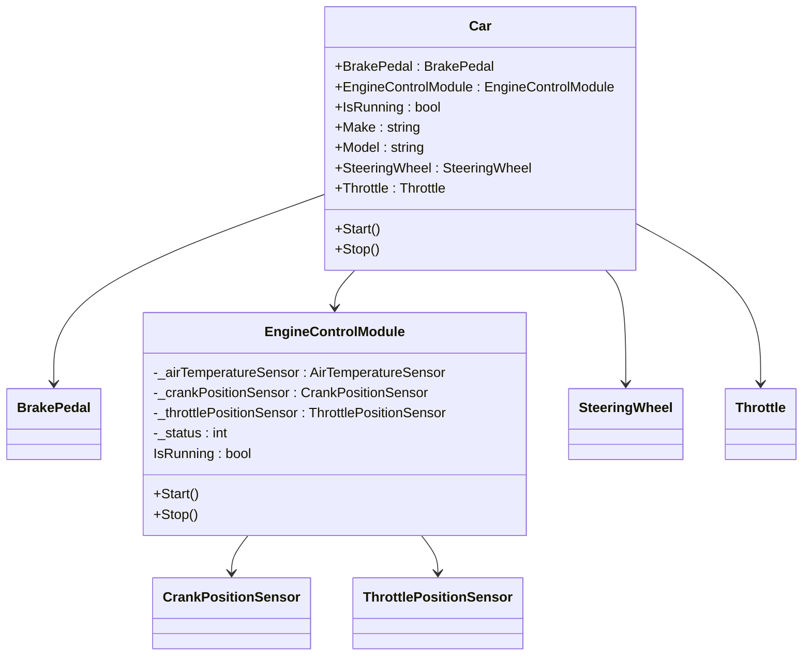

# 03 - The Four Pillars

Example diagrams for module 3 - The Four Pillars

## Class Diagram

```mermaid
classDiagram
	class Car {
		+BrakePedal : BrakePedal
		+EngineControlModule : EngineControlModule
		+IsRunning : bool
		+Make : string
		+Model : string
		+SteeringWheel : SteeringWheel
		+Throttle : Throttle
		+Start()
		+Stop()
	}
	Car --> BrakePedal
	Car --> EngineControlModule
	Car --> SteeringWheel
	Car --> Throttle
	class EngineControlModule {
		-_airTemperatureSensor : AirTemperatureSensor
		-_crankPositionSensor : CrankPositionSensor
		-_throttlePositionSensor : ThrottlePositionSensor
		-_status : int
		IsRunning : bool
		+Start()
		+Stop()
	}
	EngineControlModule --> CrankPositionSensor
	EngineControlModule --> ThrottlePositionSensor
```
