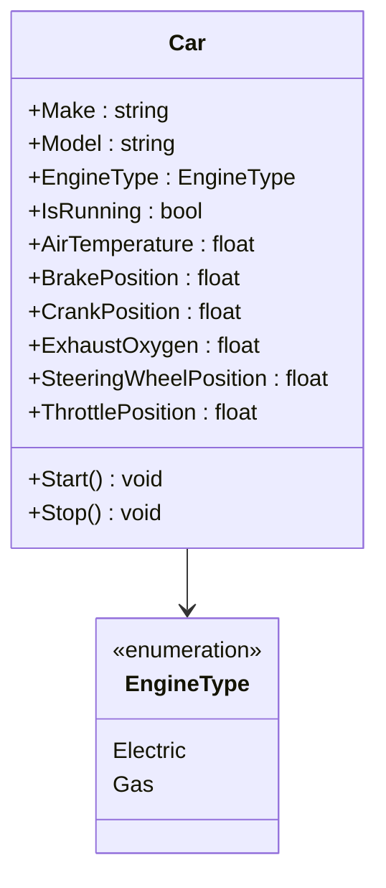

# 03 - The SOLID Principles

Example diagrams for module 4 - The SOLID Principles

## Class Diagram

```mermaid
classDiagram
	class Car {
		+Make : string
		+Model : string
		+EngineType : EngineType
		+IsRunning : bool
		+AirTemperature : float
		+BrakePosition : float
		+CrankPosition : float
		+ExhaustOxygen : float
		+SteeringWheelPosition : float
		+ThrottlePosition : float
		+Start() void
		+Stop() void
	}
	Car --> EngineType

	class EngineType {
		<<enumeration>>
		Electric
		Gas
	}
```
