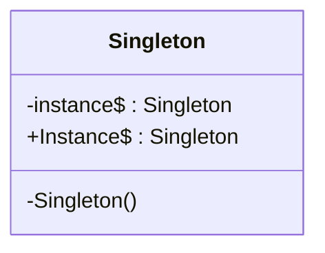

# 05 - Design Patterns

Example diagrams for module 5 - Design Patterns

## Singleton

```mermaid
classDiagram
	class Singleton {
		-instance$ : Singleton
		+Instance$ : Singleton
		-Singleton()
	}
```
