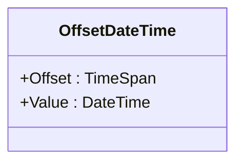

# 08 - Object-oriented Solutions to Common Problems

Example diagrams for module 8 - Object-oriented Solutions to Common Problems

## OffsetDateTime

```mermaid
classDiagram
	class OffsetDateTime {
		+Offset : TimeSpan
		+Value : DateTime
	}
```
