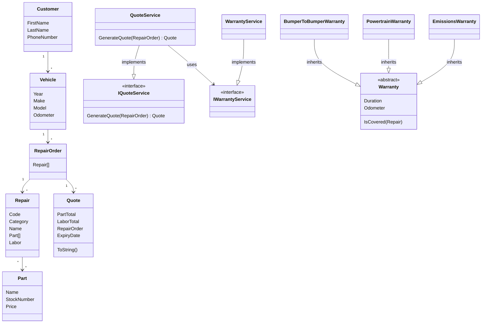

# 09 - Putting it All Together

Example diagrams for module 9 - Putting it All Together

## Diagram

```mermaid
classDiagram
	class Customer {
		FirstName
		LastName
		PhoneNumber
	}
	Customer "1" --> "*" Vehicle

	class Vehicle {
		Year
		Make
		Model
		Odometer
	}
	Vehicle "1" --> "*" RepairOrder

	class RepairOrder {
		Repair[]
	}
	RepairOrder "1" --> "*" Repair
	RepairOrder "1" --> "*" Quote

	class Repair {
		Code
		Category
		Name
		Part[]
		Labor
	}
	Repair "*" --> "*" Part

	class Part {
		Name
		StockNumber
		Price
	}

	class Quote {
		PartTotal
		LaborTotal
		RepairOrder
		ExpiryDate
		ToString()
	}

	class IQuoteService {
		<<interface>>
		GenerateQuote(RepairOrder) Quote
	}

	class QuoteService {
		GenerateQuote(RepairOrder) Quote
	}
	QuoteService --|> IQuoteService : implements
	QuoteService --> IWarrantyService : uses

	class IWarrantyService {
		<<interface>>
	}

	class WarrantyService {
	}
	WarrantyService --|> IWarrantyService : implements

	class Warranty {
		<<abstract>>
		Duration
		Odometer
		IsCovered(Repair)
	}

	class BumperToBumperWarranty {
	}
	BumperToBumperWarranty --|> Warranty : inherits

	class PowertrainWarranty {
	}
	PowertrainWarranty --|> Warranty : inherits

	class EmissionsWarranty {
	}
	EmissionsWarranty --|> Warranty : inherits
```