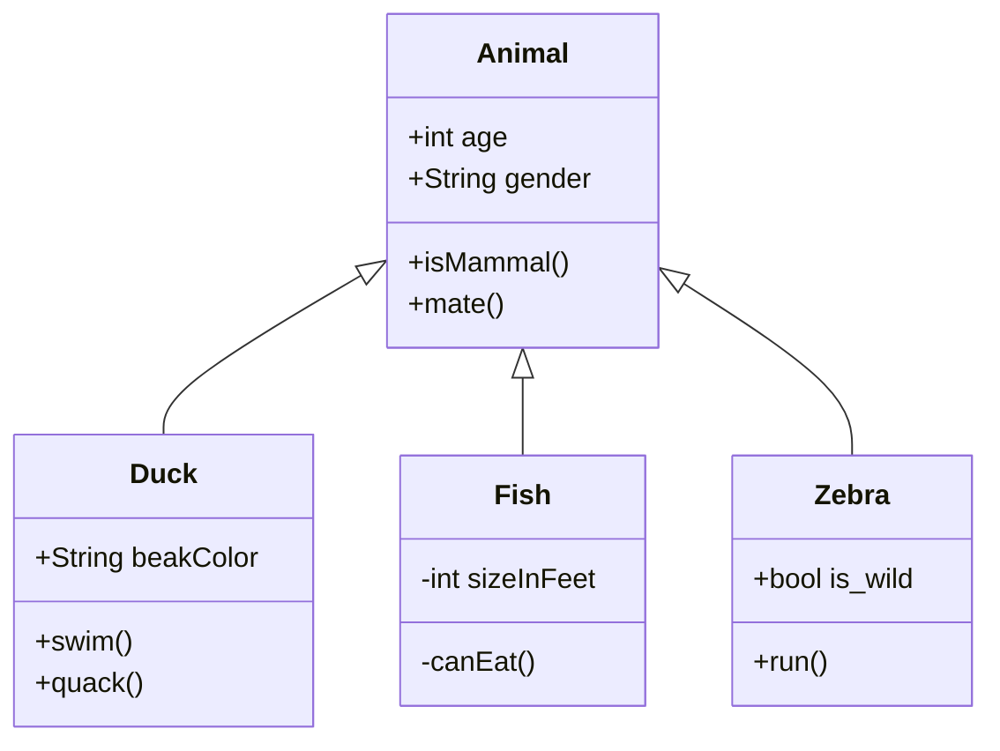
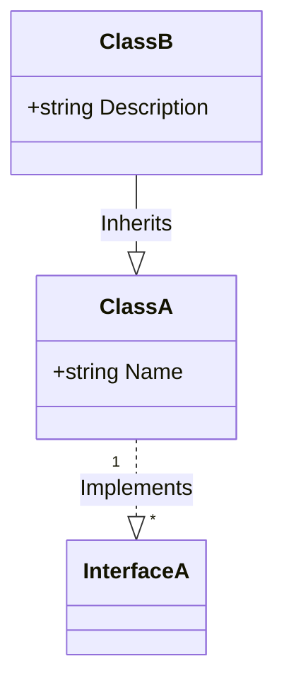

# Object-oriented Design with C# 10

This repository contains demo assets for my Pluralsight course "Object-Oriented Design with C# 10". There are multiple different demos, organized under a single solution. The main branch contains the final state of all demos at the end of the course. Other branches will be taken at various points during the course. 

## Branches

Branches exist for the beginning and ending point of each module, except for Module 1, which is the course overview. Clone the repository and switch to the appropriate starting branch for each module if you want to follow along, or check out the "-end" branch to see the final state of the project at the end of that module.

- 02-introduction
- 02-introduction-end
- 03-pillars
- 03-pillars-end
- 04-solid
- 04-solid-end
- 05-patterns
- 05-patterns-end
- 06-nullability
- 06-nullability-end
- 07-records
- 07-records-end
- 08-solutions
- 08-solutions-end
- 09-together
- 09-together-end

## Diagrams
This course makes frequent use of UML diagrams. For simplicity, they have been rendered in markdown files using the Mermaid syntax. They can be viewed from within Visual Studio through the use of an appropriate extension such as Mads Kristensen's "Markdown Editor v2", which you can install from Visual Studio's extension manager, or download from the Visual Studio Marketplace [here](https://marketplace.visualstudio.com/items?itemName=MadsKristensen.MarkdownEditor2).

### Example
The following code block describes an example class diagram taken from the Mermaid [site](https://github.com/mermaid-js/mermaid). If you do not see a diagram, then you'll need to install an extension or open this readme in a tool that can understand Mermaid diagrams.

